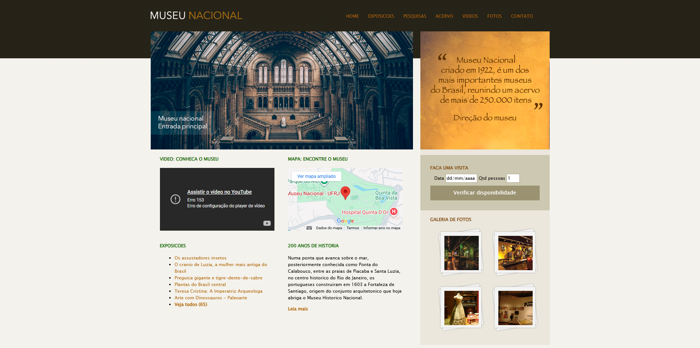

# Museu Nacional - Projeto HTML5 & CSS3

Este repositório contém o projeto **Museu Nacional**, desenvolvido como parte do curso [Desenvolvimento Web com Python e Django](https://www.udemy.com/) do professor **Jamilton Damasceno**.  
O foco deste projeto é a criação de uma página institucional utilizando **HTML5** e **CSS3**, aplicando conceitos modernos de marcação e estilização.

---

## 🚀 Tecnologias Utilizadas

### 🔹 HTML5
- Estrutura semântica (uso de `header`, `nav`, `section`, `article`, `footer`).
- Integração de imagens, vídeos e iframes.
- Formulários com novos tipos de entrada e validações nativas.
- Hierarquia e organização de conteúdo.

### 🔹 CSS3
- Layouts modernos com **Flexbox**.
- Definição de grids e seções responsivas.
- Estilização tipográfica e uso de web fonts.
- Aplicação de cores, backgrounds e efeitos visuais.
- Ajustes de design para diferentes tamanhos de tela (**responsividade**).

---

## 🎯 Objetivo do Projeto
O projeto busca reproduzir uma página institucional fictícia para o **Museu Nacional**, praticando:
- Estruturação correta do conteúdo com **HTML5 semântico**.
- Construção de um **layout responsivo** e adaptável a dispositivos móveis.
- Uso de **boas práticas de design** com CSS3.

---

## Interface:
<p align="center">
   
</p>

## Executando: 

1. Clone este repositório:
   ```bash
   git clone https://github.com/JsnEvt/Museu-Nacional.git
   cd Museu_Nacional

2. Abra o arquivo index.html no seu navegador preferido.

3. Explore a página e suas seções.

## 📌 Observações

O projeto é estático (não utiliza backend nem banco de dados).

Foi construído como exercício prático de HTML5 e CSS3.

## 👨‍💻 Autor
Este projeto foi desenvolvido por **Jason Santos**, como parte das práticas do curso **Desenvolvimento Web com Python e Django** do professor Jamilton Damasceno (https://www.udemy.com/)
